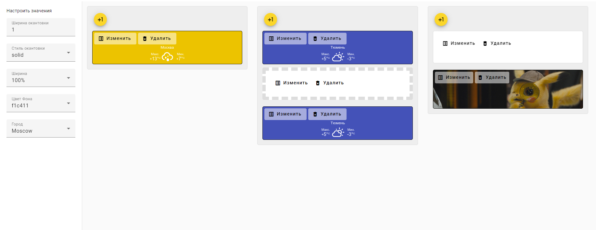

Перед выполнением:
1. установите node версии v16.20.0
2. Выполните `npm i`. (Выполните в корне приложения)
3. Выполните `npm run start`. (Выполните в корне приложения)
Перейдите `http://localhost:4200/`.

